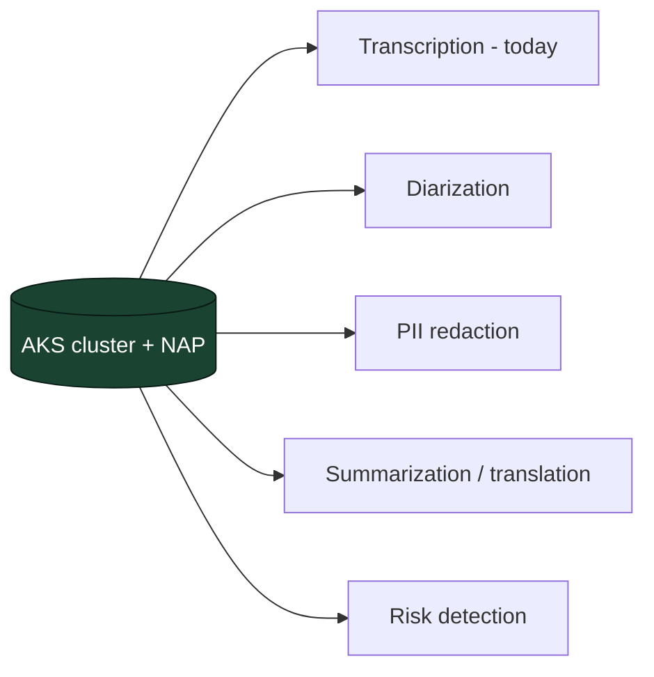

# Architecture Analysis: Hosting the Audio Transcription Service on AKS

> **Document type:** Architecture analysis / platform evaluation (analysis only — no POC was executed)
> **Workload (current):** A single application — an AI model that converts uploaded **audio files into text transcripts** (ASR inference) for audit purposes.
> **GPU:** NVIDIA Tesla T4 16 GB (`NCasv3_T4` family, e.g. `Standard_NC4as_T4_v3`).
> **Audience:** Engineering, Platform, Leadership · **Date:** 2026-06-08
> **Companion analysis:** [ACA-vs-AKS-GPU-Architecture-Decision.md](ACA-vs-AKS-GPU-Architecture-Decision.md)
> Costs are **indicative** — validate in the [Azure Pricing Calculator](https://azure.microsoft.com/pricing/calculator/).

---

## 1. Purpose and Scope

This document presents an analysis recommending **Azure Kubernetes Service (AKS)** as the hosting platform for the **current single workload**: an AI model that transcribes audio to text for audit review. It focuses on the platform justification grounded in Microsoft documentation, including the cost and efficiency capabilities of AKS, and a cost view for the single application.

| | |
|---|---|
| **In scope** | The single transcription model: GPU hosting, horizontal scaling, event-driven processing, cost, efficiency, security, and networking. |
| **Out of scope** | Additional AI services. These are addressed only as **Future Considerations** in §7. |

---

## 2. Current Workload

| Attribute | Detail |
|---|---|
| Application count | **One** — audio-to-text transcription model |
| Processing | Audio file in → transcript text out (GPU inference) |
| Trigger | User uploads an audio file; the service transcribes and returns text |
| Usage pattern | Unpredictable / intermittent |
| Parallelism | Each audio file is an **independent** unit of work (well-suited to horizontal scaling) |
| GPU | NVIDIA T4 (inference-optimized; the model fits comfortably in 16 GB) |

---

```mermaid
flowchart LR
    U[� User / Auditor] -->|🎵 Audio file| UP[📤 Upload service]
    UP --> Q{❓ AKS or ACA?}
    Q -->|AKS| A[☸️ AKS + NAP]
    Q -->|ACA| C[🟦 ACA serverless]
    A --> G[🎮 T4 GPU inference]
    C --> G
    G --> T[🎧 Transcribe audio]
    T --> R[📝 Transcript response]
    R --> DB[(🗄️ Audit record)]

    classDef user fill:#475569,stroke:#1e293b,color:#ffffff;
    classDef upload fill:#1d4ed8,stroke:#1e3a8a,color:#ffffff;
    classDef choice fill:#f59e0b,stroke:#b45309,color:#111827;
    classDef aks fill:#16a34a,stroke:#14532d,color:#ffffff;
    classDef aca fill:#0ea5e9,stroke:#075985,color:#ffffff;
    classDef gpu fill:#dc2626,stroke:#7f1d1d,color:#ffffff;
    classDef transcribe fill:#7c3aed,stroke:#4c1d95,color:#ffffff;
    classDef response fill:#059669,stroke:#064e3b,color:#ffffff;
    classDef store fill:#0f766e,stroke:#134e4a,color:#ffffff;

    class U user;
    class UP upload;
    class Q choice;
    class A aks;
    class C aca;
    class G gpu;
    class T transcribe;
    class R response;
    class DB store;
```

## 3. Why AKS for This Workload

### 3.1 Core platform capabilities

The capabilities below are grounded in current Microsoft documentation.

| Azure capability | Relevance to the transcription app | Reference |
|---|---|---|
| **Node Auto Provisioning (NAP)** — Microsoft-managed Karpenter | Provisions, right-sizes, consolidates, and **scales GPU nodes to zero** — no node-pool maintenance | [aks/node-autoprovision](https://learn.microsoft.com/en-us/azure/aks/node-autoprovision) |
| **AKS Automatic** pod-readiness SLA | 99.9% of qualifying pods ready within 5 minutes | [aks/node-autoprovision](https://learn.microsoft.com/en-us/azure/aks/node-autoprovision) |
| **GPUs on AKS** | Schedule the model on T4 GPU nodes (`nvidia.com/gpu`) | [aks/use-nvidia-gpu](https://learn.microsoft.com/en-us/azure/aks/use-nvidia-gpu) |
| **AKS-managed GPU node pools** (preview) | AKS maintains **driver + device plugin + DCGM** | [aks/aks-managed-gpu-nodes](https://learn.microsoft.com/en-us/azure/aks/aks-managed-gpu-nodes) |
| **NVIDIA GPU Operator** | Driver lifecycle, GPU metrics, and **GPU sharing** (time-slicing / MPS) | [aks/nvidia-gpu-operator](https://learn.microsoft.com/en-us/azure/aks/nvidia-gpu-operator) |
| **KEDA** event-driven autoscaling | Scale model pods **0→N** on Service Bus queue depth | [aks/keda-about](https://learn.microsoft.com/en-us/azure/aks/keda-about) |
| **Artifact Streaming (ACR)** | Reduce image-pull time for large GPU images (preview) | [container-registry/artifact-streaming](https://learn.microsoft.com/en-us/azure/container-registry/container-registry-artifact-streaming) |
| **Managed Prometheus + Grafana + Container Insights** | GPU/cluster observability out of the box | [azure-monitor/prometheus](https://learn.microsoft.com/en-us/azure/azure-monitor/essentials/prometheus-metrics-overview) |

### 3.2 Cost and efficiency capabilities (AKS advantage)

Beyond scale-to-zero, AKS provides several utilization and cost levers that the serverless alternative (ACA) does not. These are first-class reasons to choose AKS.

| Lever | What it does | Applicability to the current app | Reference |
|---|---|---|---|
| **Scale-to-zero** | Idle workload consumes no GPU; nodes consolidate to zero | Used now — primary idle-cost control | [aks/node-autoprovision](https://learn.microsoft.com/en-us/azure/aks/node-autoprovision) |
| **Spot instances** | Discounted GPU from spare Azure capacity | Usable now for retry-tolerant async transcription | [aks/spot-node-pool](https://learn.microsoft.com/en-us/azure/aks/spot-node-pool) |
| **GPU sharing** (time-slicing / MPS) | Multiple pods share one physical T4 | Usable now if individual clips underuse the T4 | [aks/nvidia-gpu-operator](https://learn.microsoft.com/en-us/azure/aks/nvidia-gpu-operator) |
| **Bin-packing** | Karpenter schedules multiple pods onto each node and consolidates under-used nodes | Used now across transcription replicas; greater value with more workloads | [aks/node-autoprovision](https://learn.microsoft.com/en-us/azure/aks/node-autoprovision) |
| **Different GPU SKUs (multi-SKU NodePool)** | One NodePool spans several GPU SKUs; Karpenter picks the cheapest that fits each pod | Single T4 today; ready for mixed SKUs without re-platforming | [aks/node-autoprovision](https://learn.microsoft.com/en-us/azure/aks/node-autoprovision) |
| **Reserved Instances / Savings Plans** | Discount committed steady usage (1- or 3-year) | Limited now (bursty/idle); applies once a steady baseline exists | [cost-management/reservations](https://learn.microsoft.com/en-us/azure/cost-management-billing/reservations/save-compute-costs-reservations) |

#### Bin-packing
Karpenter (via NAP) places multiple pods onto each GPU node according to their resource requests and **consolidates** under-utilized nodes by rescheduling pods onto fewer nodes. For the transcription service this raises density across replicas and reduces the number of GPU nodes required. Reference: [aks/node-autoprovision](https://learn.microsoft.com/en-us/azure/aks/node-autoprovision).

#### GPU sharing (time-slicing / MPS)
By default a pod requesting `nvidia.com/gpu: 1` owns the entire T4. With the NVIDIA GPU Operator, **time-slicing** (the GPU rapidly switches between pods) or **MPS** (concurrent execution) lets several transcription pods share one T4 — fewer GPUs for the same throughput. Note: these modes provide **no strong memory/fault isolation**, so they suit many small, trusted, retry-tolerant jobs. Hardware-isolated partitioning (**MIG**) is available only on A100/H100, **not on the T4**. Reference: [aks/nvidia-gpu-operator](https://learn.microsoft.com/en-us/azure/aks/nvidia-gpu-operator).

#### Different GPU SKUs (multi-SKU NodePool)
A NAP `NodePool`/`AKSNodeClass` can list **multiple GPU SKUs**, and Karpenter provisions the **cheapest VM that satisfies each pod's `nvidia.com/gpu` request and constraints**, then consolidates under-used nodes. Today this runs on a single T4 SKU; the same cluster can later mix SKUs (for example T4 for light inference, A10/A100 for heavier models) with no re-platforming. ACA, by contrast, is fixed to **T4 or A100** profiles only. Reference: [aks/node-autoprovision](https://learn.microsoft.com/en-us/azure/aks/node-autoprovision).

#### Spot instances — possible, but why limited
**Possible on AKS** via a Spot GPU node pool. Constraints to design around:
- **No SLA / can be evicted** when Azure reclaims capacity — suited to **retry-tolerant, async** transcription, not latency-critical synchronous calls.
- **Secondary pool only** (cannot be the system/default pool); requires taints/tolerations.
- **Variable pricing**; `spotMaxPrice` and priority are fixed at creation.

Recommended pattern: a **Spot GPU pool for batch** plus a small **on-demand pool** for latency-sensitive traffic. Reference: [aks/spot-node-pool](https://learn.microsoft.com/en-us/azure/aks/spot-node-pool).

#### Reserved Instances / Savings Plans — possible, but why limited
**Possible**, discounting compute via a 1- or 3-year commitment. Why their value is **limited for a bursty, scale-to-zero workload**:
- They reward **always-on, predictable** usage; a workload that scales to zero is idle much of the time, so a full-time commitment can be under-utilized.
- They suit a **known steady baseline**, which emerges once usage is consistently high.
- **Guidance:** apply reservations/savings plans to the **steady baseline** once duty cycle is measured, and keep **Spot + scale-to-zero** for the variable burst. Reference: [cost-management/reservations](https://learn.microsoft.com/en-us/azure/cost-management-billing/reservations/save-compute-costs-reservations).

### 3.3 Where AKS leads the serverless alternative (ACA)

These efficiency levers are **structurally unavailable on ACA serverless GPU**, which is the core reason AKS is the stronger platform for this GPU workload:

| Capability | AKS | ACA serverless GPU |
|---|---|---|
| Scale-to-zero | ✅ Yes (NAP + KEDA) | ✅ Yes |
| Spot (discounted GPU) | ✅ Yes | ❌ No Spot in any plan |
| Idle billing rate | Node scales to zero | ❌ Always billed **active rate** (no idle discount) |
| GPU sharing (time-slicing / MPS) | ✅ Yes (GPU Operator) | ❌ No multi/fractional GPU |
| Bin-packing (many pods per node) | ✅ Yes | ❌ One replica per app |
| Different GPU SKUs (multi-SKU) | ✅ Any supported SKU | ❌ T4 or A100 profiles only |
| Reserved Instances / Savings Plans | ✅ Applies to steady baseline | ⚠️ Limited |

> **Verified:** ACA Spot/idle-rate facts from the [ACA billing docs](https://learn.microsoft.com/en-us/azure/container-apps/billing); ACA GPU/profile limits from the [ACA serverless GPU overview](https://learn.microsoft.com/en-us/azure/container-apps/gpu-serverless-overview).

**Summary for this workload:** AKS + NAP delivers **no node-pool management** and **scale-to-zero**, plus **Spot, GPU sharing, bin-packing, and multi-SKU** efficiency that ACA cannot provide — while keeping the control, networking, and compliance depth required for audit data, and aligning with the team's existing **AKS expertise and in-progress ACS→AKS migration**.

---

## 4. Cost View (current single application)

AKS + NAP scales GPU nodes to zero, so idle cost reduces to a small **shared baseline** (managed control plane + a small always-on CPU system pool). GPU compute is billed only while transcription runs.

| Cost element | Behaviour |
|---|---|
| GPU node (T4) | Billed only while a transcription job holds the node; **scales to zero** when idle |
| Control plane (Standard tier) | Small fixed fee with uptime SLA |
| CPU system pool | Small always-on baseline shared by all current and future workloads |
| **Active cost levers (single app)** | **Scale-to-zero** (NAP + KEDA), **Spot** for async jobs, **GPU sharing** if clips underuse the T4, right-size to the smallest T4 that fits the model |

> **Verified note:** Per the [ACA billing docs](https://learn.microsoft.com/en-us/azure/container-apps/billing), ACA serverless GPU apps are **always billed at the active rate** (no idle discount) and have **no Spot option**. For a single, low-duty app, ACA per-second billing can be marginally cheaper at idle; AKS adds **Spot, GPU sharing, and bin-packing** to reduce GPU count and unit cost.

---

## 5. Operations, Security and Networking

| Area | Capability |
|---|---|
| Node management | **NAP** provisions/consolidates GPU nodes; managed control plane with auto-upgrade and maintenance windows |
| GPU lifecycle | Drivers via default install or **GPU Operator**; **DCGM** GPU metrics |
| Observability | Container Insights + Managed Prometheus + Grafana |
| Networking | Private cluster, private endpoints to Blob/Service Bus/Key Vault, network policy, controlled egress |
| Identity & secrets | Microsoft Entra **Workload Identity**, managed identity, Key Vault (CSI) |
| Compliance | Signed images, Azure Policy for AKS / Gatekeeper, full control-plane/node/pod audit logs |

> **NAP constraints to note:** cannot run alongside the cluster autoscaler; managed identity only (no service principal); a NAP cluster cannot be stopped; custom VNet requires a Standard Load Balancer. Reference: [aks/node-autoprovision](https://learn.microsoft.com/en-us/azure/aks/node-autoprovision).

---

## 6. Future Considerations — Additional AI Workloads

The analysis above targets the **single transcription app**. If additional AI workloads are introduced later (for example: speaker diarization, PII redaction, translation, summarization, risk detection), the **same AKS cluster extends without re-platforming**.

The efficiency levers described in §3.2 — **bin-packing, GPU sharing, multi-SKU NodePools, Spot, and reserved capacity** — apply individually today and compound as more workloads are added: mixed workloads pack onto shared GPU nodes, lighter models share GPUs, heavier models draw a larger SKU from the same cluster, and a measured steady baseline becomes eligible for reserved/savings-plan discounts. Because ACA cannot provide these levers, the gap in AKS's favour widens with each additional workload.

No change of platform is required to grow from the single transcription service to a multi-workload AI footprint.

---

## 7. Recommendation

**Adopt AKS + NAP to host the current audio-transcription service.**

For the single application today, AKS + NAP provides **no node-pool management** and **scale-to-zero GPU**, plus the **Spot, GPU sharing, bin-packing, and multi-SKU** efficiency levers that ACA structurally lacks (§3.2–3.3), the control and compliance depth required for audit data, and alignment with the team's AKS expertise and ACS→AKS migration. The same cluster extends to additional AI workloads later (§6) without re-platforming, at which point those same levers further reduce unit cost.

---

## 8. References

- AKS — Node Auto Provisioning (managed Karpenter): https://learn.microsoft.com/en-us/azure/aks/node-autoprovision
- AKS — Use NVIDIA GPUs: https://learn.microsoft.com/en-us/azure/aks/use-nvidia-gpu
- AKS — AKS-managed GPU node pools (preview): https://learn.microsoft.com/en-us/azure/aks/aks-managed-gpu-nodes
- AKS — NVIDIA GPU Operator: https://learn.microsoft.com/en-us/azure/aks/nvidia-gpu-operator
- AKS — KEDA add-on: https://learn.microsoft.com/en-us/azure/aks/keda-about
- AKS — Spot node pools: https://learn.microsoft.com/en-us/azure/aks/spot-node-pool
- ACR — Artifact Streaming (preview): https://learn.microsoft.com/en-us/azure/container-registry/container-registry-artifact-streaming
- Azure Monitor — Managed Prometheus: https://learn.microsoft.com/en-us/azure/azure-monitor/essentials/prometheus-metrics-overview
- Cost Management — Reserved Instances / Savings Plans: https://learn.microsoft.com/en-us/azure/cost-management-billing/reservations/save-compute-costs-reservations
- ACA — Serverless GPU overview (comparison): https://learn.microsoft.com/en-us/azure/container-apps/gpu-serverless-overview
- ACA — Billing: https://learn.microsoft.com/en-us/azure/container-apps/billing
- Azure Pricing Calculator: https://azure.microsoft.com/pricing/calculator/

> Cost figures in this document are indicative and intended to illustrate trend and method. Validate against the Azure Pricing Calculator for the target region and agreement before budgeting. For the balanced platform comparison, see [ACA-vs-AKS-GPU-Architecture-Decision.md](ACA-vs-AKS-GPU-Architecture-Decision.md).
